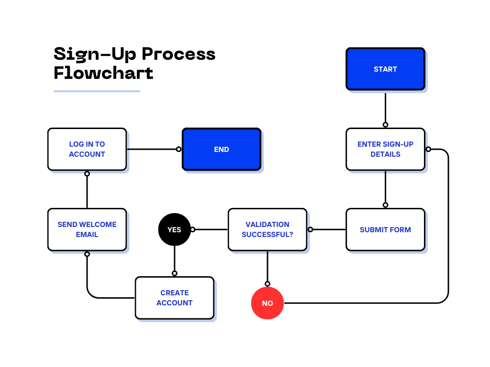
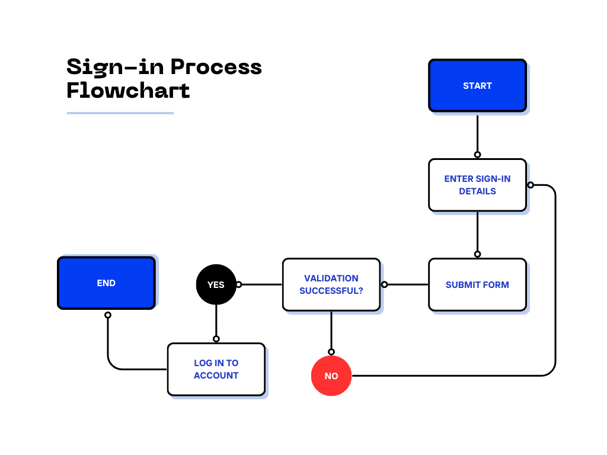

# kTrade Analysis for Traders

Welcome to the kTrade Analysis for Traders software! This README will guide you through the setup, usage, and features of kTrade, including the sign-up, sign-in processes, workflow, and technical analysis system.

---

## Table of Contents

1. [Introduction](#introduction)
2. [Tech Stack](#tech-stack)
3. [Getting Started](#getting-started)
4. [Sign-Up Process](#sign-up-process)
5. [Sign-In Process](#sign-in-process)
6. [Workflow Process](#workflow-process)
7. [Trading Bot](#trading-bot)
8. [Technical Analysis System](#technical-analysis-system)
9. [Troubleshooting](#troubleshooting)
10. [Contact Support](#contact-support)
11. [License](#license)

---

## Introduction

kTrade is a web-based platform designed to provide advanced analysis tools for traders. It helps users make informed trading decisions, track market trends, and optimize their strategies. The platform features a sophisticated trading bot and a robust technical analysis system.

---

## Tech Stack

kTrade is built using the following technologies:

- **HTML5**: For structuring web content.
- **CSS3**: For styling and layout.
- **JavaScript**: For interactive elements and dynamic content.
- **jQuery**: For simplified DOM manipulation and event handling.
- **Bootstrap**: For responsive design and UI components.
- **Python**: For server-side logic and data processing.
- **Firebase**: For real-time database, authentication, and hosting.

---

## Getting Started

1. **Access the Web Application**: Open your preferred web browser and navigate to the kTrade URL.

2. **System Requirements**: Ensure your browser is up-to-date for optimal performance. kTrade supports modern browsers including Google Chrome, Mozilla Firefox, Safari, and Microsoft Edge.

3. **Initial Setup**: Upon first visit, you may need to configure settings. Follow the on-screen instructions to set up your preferences and trading environment.

---

## Sign-Up Process

To start using kTrade, you need to create an account. Follow these steps:

1. **Open kTrade**: Navigate to the kTrade URL.

2. **Access the Sign-Up Page**:
   - Click on the "Sign Up" button located at the top-right corner of the home page.

   

3. **Complete the Form**:
   - Enter your full name, email address, and a secure password.
   - Accept the terms and conditions.

   

4. **Verify Your Email**:
   - After submitting the form, you'll receive a confirmation email. Click the verification link to activate your account.

---

## Sign-In Process

After registration, log in to your kTrade account:

1. **Open kTrade**: Navigate to the kTrade URL.

2. **Access the Sign-In Page**:
   - Click on the "Sign In" button at the top-right corner of the page.

   

3. **Enter Your Credentials**:
   - Provide your registered email address and password.

4. **Click "Sign In"**:
   - You will be redirected to your dashboard.

---

## Workflow Process

Once logged in, you can manage your trading activities:

1. **Dashboard Overview**:
   - The dashboard provides an overview of your trading account, including real-time market data and portfolio information.

   

2. **Set Up Trading Strategies**:
   - Navigate to the "Strategies" section to create or modify trading strategies.

3. **Analyze Market Data**:
   - Utilize built-in tools to analyze market trends, historical data, and trading signals.

   

4. **Execute Trades**:
   - Use the "Trade" tab to place and manage trades directly from the platform.

---

## Trading Bot

kTrade features an advanced trading bot designed to automate market analysis and trade execution:

1. **Market Analysis**:
   - The trading bot continuously analyzes market conditions, identifies patterns, and generates trading signals based on historical data and real-time trends.

2. **Trade Execution**:
   - The bot can automatically execute trades based on predefined strategies or user preferences, allowing for efficient and timely trading.

3. **Customization**:
   - Users can configure the bot's settings, including risk tolerance, trading frequency, and preferred trading pairs.

---

## Technical Analysis System

kTrade includes a powerful technical analysis system that provides actionable insights into market positions:

1. **Analysis Signals**:
   - The system evaluates various technical indicators to offer recommendations on whether to: **Strongly Sell**, **Sell**, **Be Neutral**, **Buy**, or **Strongly Buy** a position.

2. **Indicators Used**:
   - The analysis system incorporates a range of technical indicators, such as moving averages, RSI, MACD, and Bollinger Bands, to assess market conditions.

3. **Signal Display**:
   - Recommendations are displayed on the dashboard and within the analysis tools, helping users make informed decisions based on the current market scenario.

   

---

## Troubleshooting

If you encounter any issues with kTrade, consider the following troubleshooting steps:

1. **Check Internet Connection**: Ensure you have a stable internet connection.

2. **Update Browser**: Make sure your web browser is up-to-date.

3. **Clear Cache**: Try clearing your browser cache and cookies.

4. **Contact Support**: If the issue persists, reach out to our support team for assistance.

---

## Contact Support

For any questions or technical support, please contact our support team:

- **Email**: support@ktrade.com
- **Phone**: 1-800-123-4567
- **Live Chat**: Available on our website during business hours.

---

## License

kTrade is licensed under the [MIT License](LICENSE). See the LICENSE file for details.

---

Thank you for using kTrade! We hope our platform enhances your trading experience. If you have any feedback or suggestions, feel free to contact us.
```

